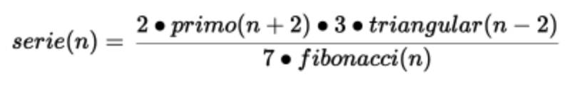
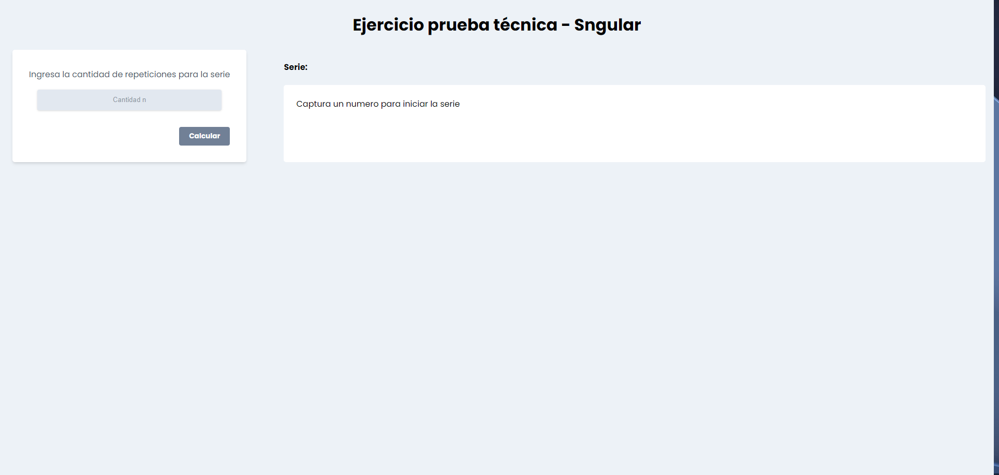

# Ejercicio Técnico - Sngular

Proyecto técnico para Sngular donde se implementa las series de Fibonacci, numero primos y números triangulares para crear una serie dada.



## **Proyecto**

El proyecto se creo con la librería de React en diferentes componentes para el formulario y ua clase para el calculo de las series antes mencionadas.

### Instalar proyecto

Para instalar las dependencias se deberá realizar el comando inicial de npm

```console
npm install
```

 Esto deberá instalar todas las dependencias necesarias para el funcionamiento correcto del proyecto.

### Scripts

El proyecto cuenta con los scrips para `test`, `build` y `start`

- Script Test: Test de los componentes y clase

  ```console
  npm run test
  ```

- Script Build: Construcción del proyecto

  ```console
  npm run build
  ```

- Script Start: Inicia servidor para pruebas

  ```console
  npm run start
  ```

## Sobre el proyecto

El proyecto esta construido con ReactJS. Se integran diferentes componentes de acuerdo a los requerimientos para el funcionamiento.

Se pueden modificar algunos aspectos visuales como el color del botón

- blue
- gray
- green
- red

y el tamaño

- sm
- md
- lg

El resultado de la secuencia puede ser modificado de acuerdo a las necesidades, se deberá modificar en la expresión `handleClick()` el método de retorno de la serie.

Los métodos que se pueden extraer de la clase son:

- `primeNumbers()`
- `fibonacci()`
- `triangularNumber()`
- `serieNumber(version)`

Se deberá crear la clase con un valor n para acceder a estos métodos.

El método `serieNumber(version)` cuenta con 2 versiones para el calculo, la version predeterminada es le 'v1':

- 'v1': En la version 1 el método realiza un calculo tomando en cuenta el valor de la posición n de la secuencia solicitada sumando o restando dependiendo el caso para los valores de primo y triangular.

  Ejemplo:

  Tomando en cuenta que $n=1$

  - Conversion de numero primo

    $primo(n + 2) = 2 + 2 =4$

  - Conversion de numero triangular

    $triangular(n-1) = 1-2=-1$

  - Conversion de numero de Fibonacci

    $7*fibonacci(n) = 7*1=7$

  - Conversion de formula serie con valores reales

    $(2*4*3*-1)/7 = -3.428$

- 'v2': Para la version 2 el método realizar el calculo en base a valor de n sumando o restando dependiendo el caso, primo y triangular respectivamente, y tomando en cuenta el valor de dicho calculo para la sustitución en la formula.

  Ejemplo:

  Tomando en cuenta que $n=1$

  - Conversion de numero primo

    $n+2 = 1 +2 = 3$

    $primo(3) = 5$

  - Conversion de numero triangular, para los casos negativos se toma como inicial el valor 1

    $n-2= 1$

    $triangular(1) = 1$

  - Conversion de numero de Fibonacci

    $7*fibonacci(n) = 7*1=7$

  - Conversion de formula serie con valores reales

    $(2*5*3*1)/7 = 4.285$

## Resultado

La instalación del proyecto deberá verse asi:



Funcionando todos los componente en una sola aplicación.

### Contacto

Si tienes alguna mejora que me pudiera ayudar en su estructura o funcionamiento agradecería enormemente el apoyo.
